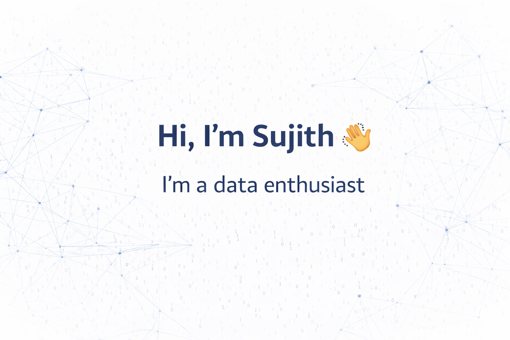

  

<b>Data Analyst • Data Engineer • Data Scientist</b> 
MS Data Science @ University of Colorado Boulder

📍 Boulder, Colorado

---

## 👨‍💻 About Me

I am a **data-driven professional and graduate student in Data Science** with hands-on experience in **analytics, machine learning, data engineering, and visualization**.  
My work spans **healthcare analytics, marketing intelligence, geospatial analysis, and ML research**, with a strong focus on turning data into measurable business impact.

> **“Knowledge is Open-Source, and impact comes from applying it responsibly.”**

---

## 🎓 Education

**Relevant Coursework:**  
Machine Learning, Data Mining, Big Data Architecture, Information Visualization,  
Geographic Information Systems, Statistics & Probability, Data Ethics

---

## 🚀 Projects

- 📊 Registration Funnel Analytics Dashboard  **Capstone Project – UC Boulder & AasnTe**

- 🌱 Crop Recommendation System (Machine Learning)

---

## 📈 GitHub Analytics

---

## 🌐 Connect With Me

📧 **Email:** battusujith2525@gmail.com

---

⭐ Feel free to explore my repositories and connect — always open to collaboration and data-driven conversations.
